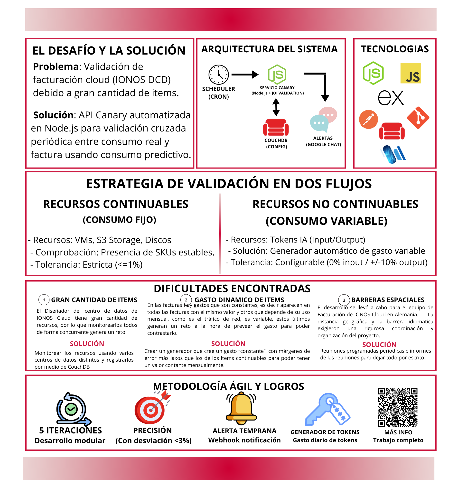

# Sistema de Validación en Facturación de Servicios Cloud

Trabajo Fin de Grado — Grado en Ingeniería Informática
Universidad de La Rioja, Facultad de Ciencia y Tecnología

**Autor:** Pablo Galilea Valverde
**Tutor:** Jesús María Aransay Azofra
**Curso:** 2025-2026



## Resumen

Este proyecto desarrolla un sistema automatizado de validación de la facturación del DCD (*Data Center Designer*) de IONOS Cloud. Con decenas de SKUs facturables y múltiples tipos de recursos, verificar manualmente la corrección de los cargos resulta inviable a escala.

La solución es un servicio construido en Node.js que orquesta dos tipos de comprobación:

- **Consumo constante:** verifica que los recursos de consumo continuo —máquinas virtuales, almacenamiento y discos— figuran correctamente en la factura mensual.
- **Consumo variable:** genera y valida consumo artificial —llamadas DNS, tokens de inteligencia artificial— comprobando que las cantidades facturadas coinciden con las esperadas dentro de márgenes configurables por SKU.

El sistema se apoya en CouchDB para almacenar la configuración y el histórico de verificaciones, y emplea trabajos cron para programar las comprobaciones periódicas, lanzando notificaciones automáticas ante cualquier desviación significativa. El desarrollo se llevó a cabo en cinco iteraciones siguiendo una metodología ágil, cubriendo la totalidad de los requisitos funcionales y no funcionales con una desviación respecto a la planificación inferior al 3%.

**Palabras clave:** automatización, testing, facturación, nube, validación, Node.js, CouchDB.

## Estructura del repositorio

```
├── main.tex                  # Documento principal
├── portada.tex                # Portada del documento
├── bibliografia.bib           # Referencias bibliográficas
├── compilar.sh                # Script de compilación
├── capitulos/
│   ├── 01-introduccion.tex
│   ├── 02-Análisis.tex
│   ├── 03-Planificación.tex
│   ├── 04-Iteraciones.tex
│   └── 05-Revision.tex
├── anexos/
│   ├── A1-Anexo-ListaItems.tex
│   ├── A2-Anexo-ObtenerTockenDCD.tex
│   ├── A3-Anexo-FlujoCAnary.tex
│   └── A4-Anexo-TablaObjetivos.tex
├── imagenes/                  # Figuras e imágenes del documento
├── archivos/                  # Otros archivos de apoyo
└── main.pdf                   # PDF compilado
```

## Compilación

El documento se compila con `pdflatex` + `biber` mediante el script incluido:

```bash
./compilar.sh
```

Este script genera los ficheros auxiliares en `auxiliares/` y coloca el PDF resultante (`main.pdf`) en la raíz del proyecto.

## Licencia

Este trabajo se distribuye con fines académicos como parte del Trabajo Fin de Grado del autor.
